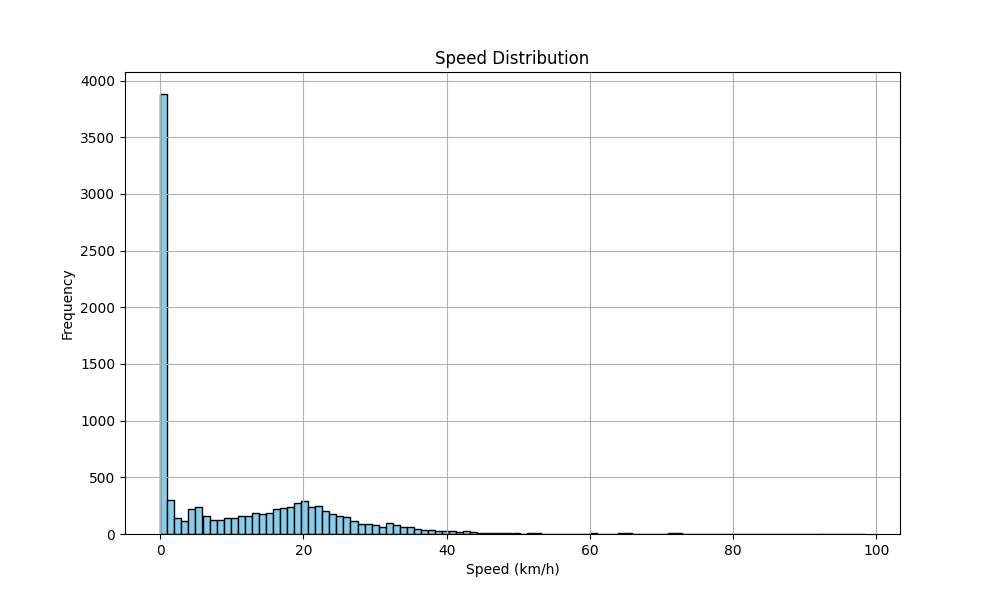
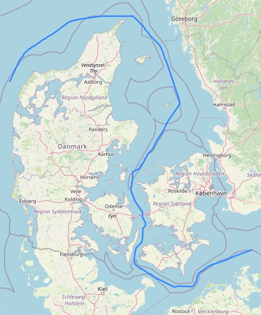

# Assignment 4: Findings

Our analysis revealed significant noise in the GPS data,
where consecutive positions often appeared far apart due to GPS inaccuracies.
To address this, we efficiently filtered the noise by considering the vessel's speed.
By examining the speed distribution,
we determined that speeds exceeding 50 km/h are highly unusual and typically represent outliers.
After applying these filters,
we identified that the vessel with the MMSI number **219133000** covered the greatest distance, traveling **781.29 km**

```
+---------+-----------------+                                                   
|     MMSI|   total_distance|
+---------+-----------------+
|219133000| 781.294261362035|
|636017000|707.9181400114417|
|308803000|701.5773900779218|
|230007000|677.5426684941149|
|636018490|669.5036571142069|
+---------+-----------------+
```

## Vessel speed

* We can see that most vessels have a top speed of around 50 km/h.
* Speeds higher than 100 km/h are unrealistic. (can be ignored)



## Longest route travelled


